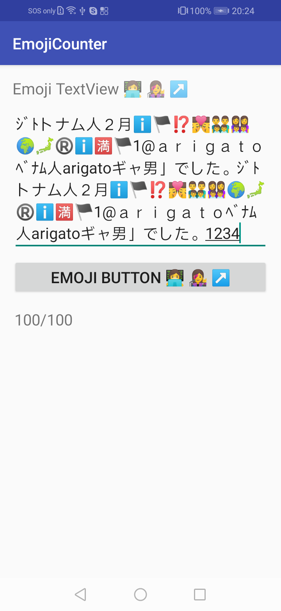

# 1. Emojicounter
Counting Emoji number, Extract all Emoji, SubString with data content contain Emoji, Android counting Emoji, Check String is Emoji character, Android Emoji counter, Emoji Utils

To unit test, you can copy the String contain the following Emoji characters into Edittext & Enjoy:
"ｼﾞﾄトナム人２月ℹ️🏴⁉️👨‍❤️‍💋‍👨👨‍👨‍👦‍👦👩‍👩‍👦‍👦🌍🗾®️ℹ️🈵🏴1@ａｒｉｇａｔｏﾍﾞﾅﾑ人arigatoギャ男」でした。ｼﾞﾄトナム人２月ℹ️🏴⁉️👨‍❤️‍💋‍👨👨‍👨‍👦‍👦👩‍👩‍👦‍👦🌍🗾®️ℹ️🈵🏴1@ａｒｉｇａｔｏﾍﾞﾅﾑ人arigatoギャ男」でした。ｼﾞﾄトナム人２月ℹ️🏴⁉️👨‍❤️‍💋‍👨👨‍👨‍👦‍👦👩‍👩‍👦‍👦🌍🗾®️ℹ️🈵🏴1@ａｒｉｇａｔｏﾍﾞﾅﾑ人arigatoギャ男」でした。ｼﾞﾄトナム人２月ℹ️🏴⁉️👨‍❤️‍💋‍👨👨‍👨‍👦‍👦👩‍👩‍👦‍👦🌍🗾®️ℹ️🈵🏴1@ａｒｉｇａｔｏﾍﾞﾅﾑ人arigatoギャ男」でした。123456789"

And here is the demo result: 
-------------

 

#2. Cut string with fullsize (shift_JIS) Japanese font using the Normalize class: 
-------------
Ref to the ShiftJISStringUnitTest.java class to enjoy. 
